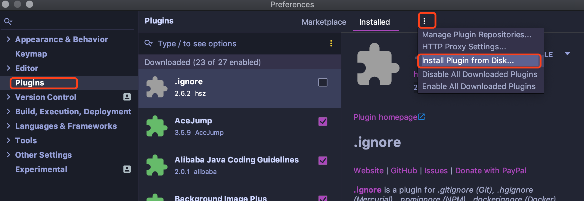

# Flyme

Flyme toolchain.

An Intellij & Android Studio plugin that adds Live Templates to your IDE saving time writing the boilerplate in Flutter.

## Install

### Automaticly

You can search `Flyme` in Preferences -> Plugins Marketplace.

### Manually

You can search `Flyme` from https://plugins.jetbrains.com, and download the `Flyme` plugin.

 Preferences -> Plugins -> Install Plugin Form Disk, select flyme-xxxx.zip, and restart IDE.

## Available Snippets

### Dart

| Shortcut      | Description               |
| ------------- | ------------------------- |
| afunc       | function in one line      |
| arrow       | simple function           |
| asdasd      | simple print              |
| asdasdasd   | simple print with params  |
| func        | create function           |
| handleFunc  | create handle function    |
| init        | init function             |
| cdatamodel  | create a data model       |
| cdatasource | create a data source        |
| clocal      | create a local data source  |
| cremote     | create a remote data source |
| crepository | create a repository         |
| cdatamodel  | create data model           |
| cdto        | create a data transformer object         |
| ctranslator | create a data model translator           |
| cfunctionvalidator  | create a function validator      |
| crepositoryimpl     | create a repository implement    |
| cvaluefailure  | create a value failure                |
| cviewobj       | create a view object                  |
| fromdm      | factory constructor from data model      |
| cstream     | create values               |
| cusecase    | create a use case           |
| cvm         | create a view model         |

### Flutter

| Shortcut   | Description                                     |
| ---------- | ----------------------------------------------- |
| builder  | create builder function                         |
| builder2   | create builder function with 2 view models      |
| builder3   | create builder function with 3 view models      |
| builder4   | create builder function with 4 view models      |
| builder5   | create builder function with 5 view models      |
| builder6   | create builder function with 6 view models      |
| dprops     | Properties for ViewModel                        |
| fdataclass | freezed data class                              |
| funcw      | functional widget                               |
| funcwp     | functional widget with props                    |
| funion     | freezed union class                             |
| funioncase | freezed union case                              |
| mi         | import                                          |
| mifunc     | import functional main.utils                         |
| mip        | import package                                  |
| mipm       | import flutter material package                 |
| mirx       | import rxdart package                           |
| miextension     | import extension             |
| oc         | something from an InheritedWidget               |
| provider   | create model provider                           |
| provider2  | create model provider with 2 view models        |
| provider3  | create model provider with 3 view models        |
| provider4  | create model provider with 4 view models        |
| provider5  | create model provider with 5 view models        |
| provider6  | create model provider with 6 view models        |
| ptf        | part freezed statement                          |
| pts        | part statement                                  |
| stanim     | create stateful widget with AnimationController |
| stful      | create stateful widget                          |
| stless     | create stateless widget                         |

## Plugin Supports the Following IDEs:

- Android Studio
- IntelliJ IDEA Ultimate
- IntelliJ IDEA Community
- IntelliJ IDEA Educational
